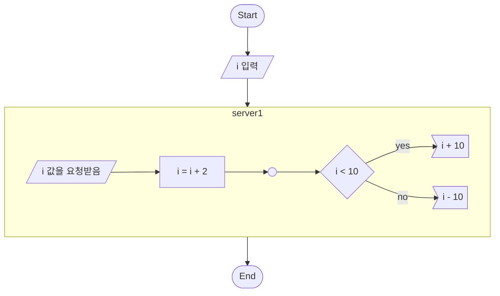

# test 폴더

여기는 test다.


```mermaid
flowchart TB
 a ---> b
 p1["김한결<br>김한결"] 
 p2["`**김한결**`"]
 p1 -->|넌못지나간다| p2
 p2 --> p2
 p2 --> p1
 ```

 ```mermaid
 flowchart TB
 st(["start"])
 p1["i = 1 "]
 inp1[/j에 값 입력/]
 bl((" "))
 p2[" i = i + 1"]
 cond1{"i < j"}
 out1>"print i "]
 en(["End"])
 st --> p1
 p1 --> inp1
 inp1 --> p2
 inp1 --> bl
 bl -->p2
 p2 --> cond1
 cond1 -->|Yes| out1
 out1 --> en
```

 ```mermaid
 flowchart TB
 st(["clac"])
 inp1[/i, j입력/]
 en(["i + j"])
 st --> inp1 --> en
 ```


 ```mermaid
 flowchart TB
 st(["Start"])
 inp1[/i, j입력/]
 calc(["clac(i,j)"])
 en(["End"])
 st --> inp1 --> calc --> en
 ```


